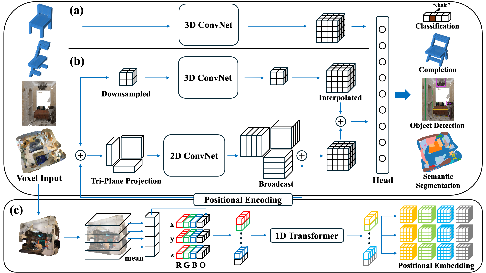

<h2>Efficient 3D Perception on Embedded Systems via Interpolation-Free Tri-Plane Lifting and Volume Fusion</h2>

[**Sibaek Lee**](https://minjae-lulu.github.io/) · [**Jiung Yeon**](https://humdrum-balance-b8f.notion.site/Jiung-Yeon-6754922a22814c9a95af88801a96fb4b) · [**Hyeonwoo Yu**](https://bogus2000.github.io/) 

Sungkyunkwan University 

## Overview

**System Overview.** (a) A dense 3D ConvNet baseline. (b) Our efficient hybrid architecture, which fuses a fast tri-plane 2D stream with a coarse 3D stream; the latter processes a downsampled volume and interpolates the features back to the original resolution. (c) The generation process of our data-adaptive positional encoding. The 3D input is summarized into 1D tokens, which a transformer processes to create dynamic positional embeddings. These embeddings act as an information bridge to retain spatial details in our pipeline.

## Code

The code is being prepared and will be uploaded soon.
